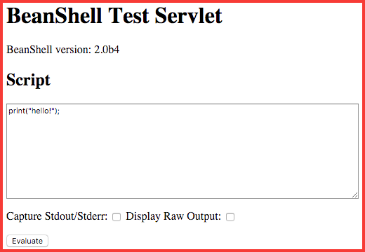

# groovy-test-servlet

Based on the same [servlet implementation](http://beanshell.org/manual/bshmanual.html#BshServlet_and_Servlet_Mode_Scripting) used by [BeanShell](http://beanshell.org)

Adds a servlet as **/eval** for running arbitrary code on the server.

Also a servlet as **/eval/status** for common status information of the server instance.

It externalizes the following variables:

* out (PrintStream)
* req (HttpServletRequest)
* res (HttpServletResponse)
* grailsApplication (DefaultGrailsApplication)

> Not recommend for production use!
